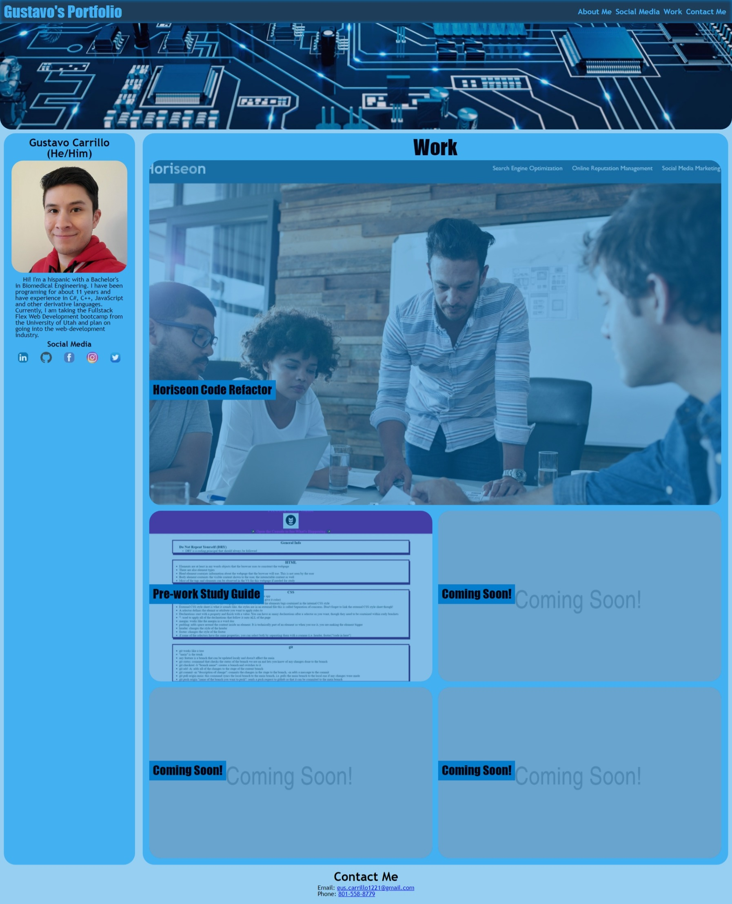
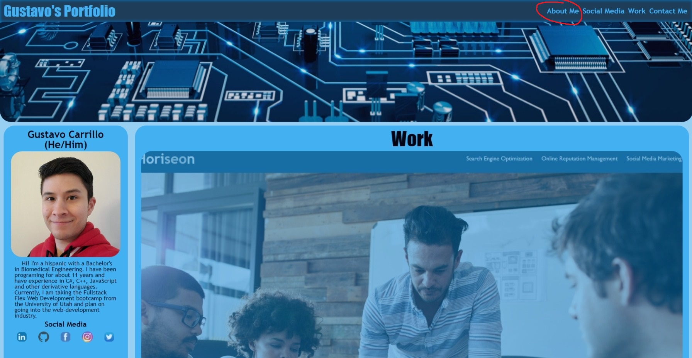
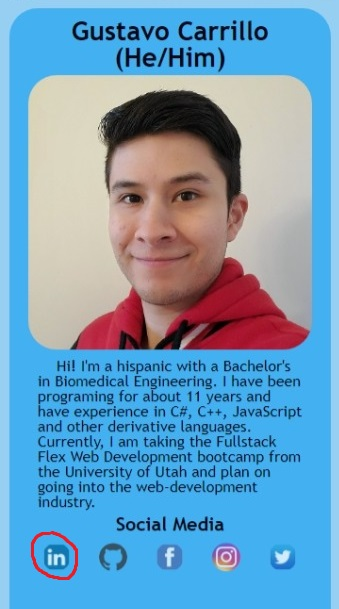
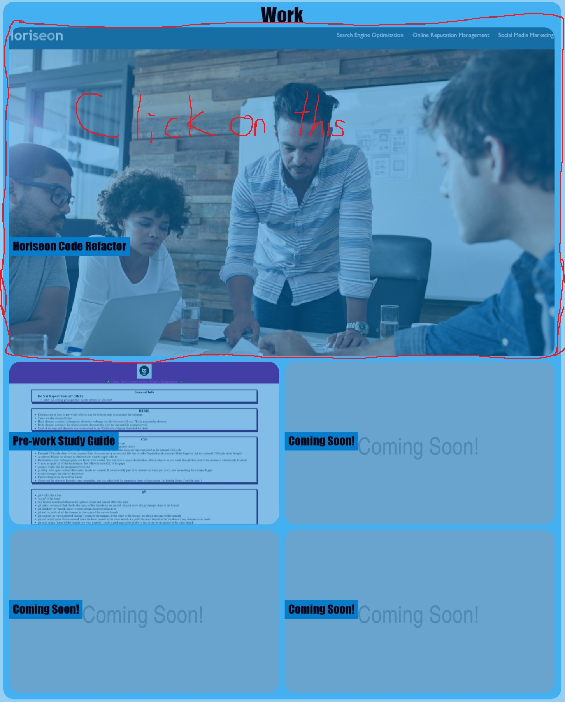
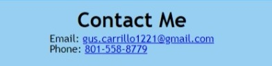

# My Portfolio

  

## Description

This is a portfolio created by me (Gustavo Carrillo) with the aim to show the work I have done to potential employers or anyone who is interested. This webpage was created to show my ability to create a website from scratch as show my mastery over HTML and CSS. As of this moment, I have two completed works (not including this webpage).

## Links
- [My Portfolio](https://0zrk23.github.io/my-portfolio/)
- [My Portfolio Repository](https://github.com/0zrk23/my-portfolio)

## Usage

To get started, you can navigate to different sections of my portfolio using the navigation bar at the top right corner of the page. For example, if you click on "About Me" it will take you to the section about me (Gustavo Carrillo).

  

You can view my social media my going to the about me and clicking on any of the social media icons, for example, it will take you to my LinkedIn profile if you click on the LinkedIn icon in the social media section. (At the moment, none of these links work except Github)

  

To view my work, navigate to the "Work" section on the webpate. In this section, there are image cards that if clicked on, will take you to projects I have worked on. (at the moment, I only have two to put up.)

  

If you wish to contact me, navigate to the "Contact Me" section. There you can see the different methods of getting in contact with me. (Currently, only my mobile and email are listed)

  

## Credits

- Credit to Nazanin Ashrafi on Dev. I used their tutorial to understand how transitions work

## License

Refer to the license on GitHub
